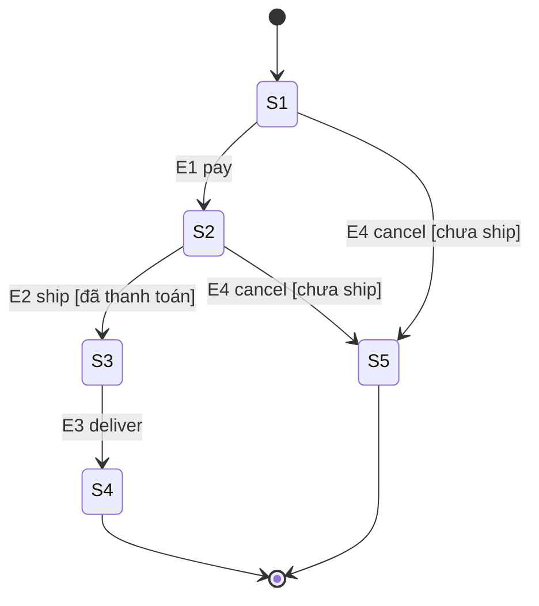

# Format Output — State Transition Test Design

Dùng ở **Kịch bản A** (khi người dùng chưa có test design). Lưu vào `test-design/test-design-<feature-kebab>.md`.

Một file test design gồm: (1) **bảng phân loại toàn bộ FR**, rồi (2) **mỗi FR phù hợp là một mục riêng** với state model + bảng chuyển trạng thái + sơ đồ Mermaid của chính nó.

---

## Quy ước bắt buộc

- Phân loại **mọi FR** trong tài liệu: `Phù hợp (trong phạm vi)` / `Không phù hợp (ngoài phạm vi)` + lý do. Không bỏ sót.
- Mỗi FR phù hợp: state mã `S1`, `S2`...; transition mã `T1`, `T2`... dạng `(state nguồn, event, [guard]) → (state đích / action)`.
- Ô "—" trong bảng = **invalid transition** hoặc không đổi trạng thái; ghi rõ hành vi mong đợi.
- **Bắt buộc** có sơ đồ Mermaid `stateDiagram-v2` cho mỗi FR, khớp 1-1 với bảng.
- Không bịa: nếu tài liệu thiếu, ghi mục **Giả định**.

---

## Khung file test design

```markdown
# State Transition Test Design — <Tên hệ thống>

## 0. Thông tin & nguồn
- Hệ thống: <tên>
- Nguồn: <README / api_spec / danh sách FR đã đọc>
- Người thực hiện / ngày: <điền>
- Giả định (nếu có): <liệt kê phần suy luận do tài liệu thiếu>

## 1. Phân loại FR
| FR ID | Mô tả ngắn | State Transition? | Lý do | Kỹ thuật thay thế (nếu ngoài phạm vi) |
|-------|-----------|-------------------|-------|----------------------------------------|
| FR-04 | Vòng đời đơn hàng | ✅ Phù hợp | Có status lifecycle, event pay/ship/cancel | — |
| FR-05 | Khóa tài khoản sau N lần sai | ✅ Phù hợp | Hành vi phụ thuộc số lần thử trước đó | — |
| FR-08 | Kiểm tra định dạng email | ❌ Ngoài phạm vi | Stateless, không có vòng đời | domain-testing / BVA |
| FR-09 | Tính phí ship theo vùng+cân nặng | ❌ Ngoài phạm vi | Logic tổ hợp, không phụ thuộc lịch sử | decision-table |

> Tổng: X FR phù hợp / Y FR ngoài phạm vi. Các mục dưới đây chỉ mô hình hóa FR phù hợp.

---

## FR-04 — Vòng đời đơn hàng

### States
| Mã | State | Ý nghĩa | Loại |
|----|-------|---------|------|
| S1 | Created | Đơn vừa tạo | initial |
| S2 | Paid | Đã thanh toán | — |
| S3 | Shipped | Đã giao vận | — |
| S4 | Delivered | Đã nhận | final |
| S5 | Cancelled | Đã hủy | final |

### Events / Guards / Actions
| Mã event | Mô tả | Guard | Action |
|----------|-------|-------|--------|
| E1 | pay | — | trừ kho, ghi giao dịch |
| E2 | ship | [đã thanh toán] | tạo mã vận đơn |
| E3 | deliver | — | đóng đơn |
| E4 | cancel | [chưa ship] | hoàn kho |

### State Transition Table
| State nguồn ↓ \ Event → | E1 pay | E2 ship | E3 deliver | E4 cancel |
|-------------------------|--------|---------|------------|-----------|
| **S1 Created** | S2 Paid / trừ kho | — | — | S5 Cancelled / hoàn kho |
| **S2 Paid** | — | S3 Shipped / tạo vận đơn | — | S5 Cancelled / hoàn kho |
| **S3 Shipped** | — | — | S4 Delivered / đóng đơn | — |
| **S4 Delivered** | — | — | — | — |
| **S5 Cancelled** | — | — | — | — |

> Invalid transitions: (S1,E2), (S1,E3), (S2,E1), (S3,E1/E2/E4), (S4,*), (S5,*) → từ chối / giữ nguyên state.

### Transition hợp lệ
| Mã | Nguồn | Event | Guard | Đích | Action |
|----|-------|-------|-------|------|--------|
| T1 | S1 | E1 pay | — | S2 | trừ kho |
| T2 | S1 | E4 cancel | chưa ship | S5 | hoàn kho |
| T3 | S2 | E2 ship | đã thanh toán | S3 | tạo vận đơn |
| T4 | S2 | E4 cancel | chưa ship | S5 | hoàn kho |
| T5 | S3 | E3 deliver | — | S4 | đóng đơn |

### State Diagram (BẮT BUỘC)



### Ghi chú độ phủ dự kiến
- 0-switch: T1..T5.
- Invalid: (S1,E2), (S2,E1), (S3,E4)...
- 1-switch: T1→T3, T1→T4, T3→T5...
- End-to-end: Created→Paid→Shipped→Delivered; Created→Cancelled.

---

## FR-05 — Khóa tài khoản sau N lần sai

<lặp lại đúng cấu trúc trên: States / Events / Table / Transition hợp lệ / State Diagram / độ phủ>
```

---

## Ghi chú
- Mỗi FR phù hợp là một mục `## FR-xx` độc lập, tự chứa đủ 5 phần + sơ đồ Mermaid.
- Sơ đồ Mermaid bắt buộc cho từng FR để reviewer đối chiếu với bảng của FR đó.
- FR ngoài phạm vi chỉ xuất hiện ở bảng phân loại (mục 1), không dựng state model.
