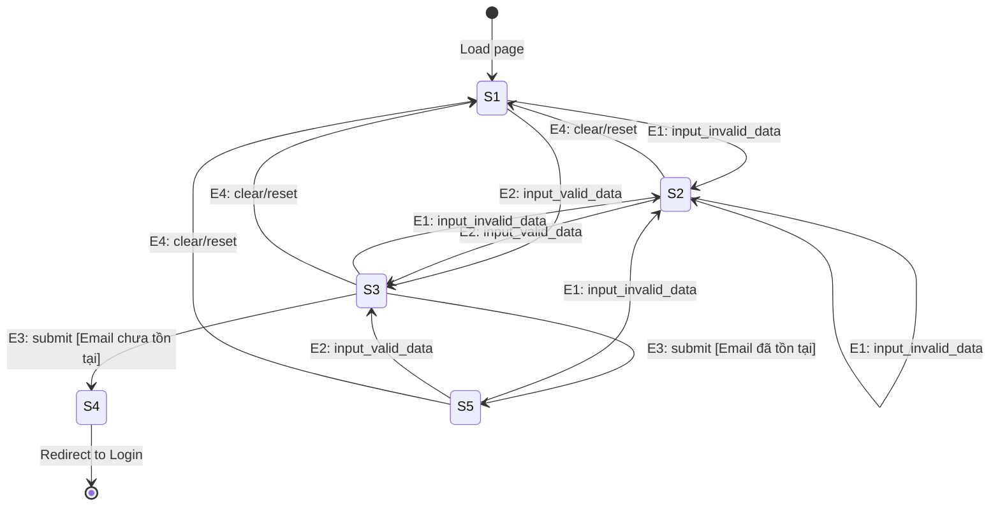

# State Transition Test Design — EShop

## 0. Thông tin & nguồn
- **Hệ thống:** EShop (Bán hàng thương mại điện tử phục vụ kiểm thử)
- **Nguồn:** `eshop/README.md`, `eshop/api_specification.md`
- **Người thực hiện:** Antigravity AI
- **Ngày thực hiện:** 2026-07-15
- **Giả định:** 
  - Quy trình đăng ký của FR-01 có thể được kiểm soát trạng thái ở mức giao diện người dùng (Client Form State) kết hợp với phản hồi từ Backend (Trùng email ở cơ sở dữ liệu).
  - Hệ thống thực hiện kiểm tra định dạng email và độ mạnh mật khẩu ngay trên form (hoặc khi bấm đăng ký) để chuyển dịch trạng thái.

---

## 1. Phân loại FR
Dưới đây là bảng phân tích toàn bộ 24 yêu cầu chức năng (FR) của hệ thống EShop nhằm xác định tính phù hợp với kỹ thuật State Transition Testing.

| FR ID | Mô tả ngắn | State Transition? | Lý do | Kỹ thuật thay thế (nếu ngoài phạm vi) |
|---|---|---|---|---|
| **FR-01** | Đăng ký tài khoản | ✅ Phù hợp | Có trạng thái biểu mẫu (Form State: Idle, Invalid, Ready) kết hợp cơ sở dữ liệu (Email đã tồn tại). | — |
| **FR-02** | Đăng nhập & Khóa tài khoản | ✅ Phù hợp | Hành vi phụ thuộc số lần thử trước đó (Unlocked, Failed_1, Failed_2, Locked_30s). | — |
| **FR-03** | Quên mật khẩu & Đặt lại mật khẩu | ✅ Phù hợp | Vòng đời 2 bước xác thực OTP và đổi mật khẩu mới. | — |
| **FR-04** | Quản lý hồ sơ cá nhân | ❌ Ngoài phạm vi | CRUD cá nhân cơ bản, stateless, không có vòng đời đối tượng. | Domain Testing / Boundary Value Analysis |
| **FR-05** | Xem danh sách & Tìm kiếm sản phẩm | ❌ Ngoài phạm vi | Hiển thị thông tin tĩnh, tìm kiếm không lưu lịch sử. | Equivalence Partitioning / Boundary Value Analysis |
| **FR-06** | Xem chi tiết sản phẩm | ❌ Ngoài phạm vi | Hiển thị chi tiết và thêm giỏ hàng stateless. | Boundary Value Analysis / GUI Checklist |
| **FR-07** | Giỏ hàng (Shopping Cart) | ✅ Phù hợp | Có trạng thái giỏ hàng (Empty, Has_Items, Checked_Out). | — |
| **FR-08** | Thanh toán (Checkout) | ❌ Ngoài phạm vi | Logic xác thực, tổng tiền tự động tính và xóa giỏ khi hoàn tất (chuyển qua đơn hàng). | Boundary Value Analysis / Equivalence Partitioning |
| **FR-09** | Mã Giảm Giá (Coupon) | ❌ Ngoài phạm vi | Logic tổ hợp phụ thuộc 5 điều kiện tĩnh. | Decision Table |
| **FR-10** | Trạng thái Đơn hàng | ✅ Phù hợp | Vòng đời đơn hàng gồm 5 trạng thái với các ràng buộc chuyển tiếp nghiêm ngặt. | — |
| **FR-11** | Xem lịch sử đơn hàng (User) | ❌ Ngoài phạm vi | Màn hình hiển thị danh sách tĩnh của user. | Domain Testing |
| **FR-12** | Kiểm soát truy cập (Admin) | ❌ Ngoài phạm vi | Xác thực & phân quyền stateless dựa trên JWT token. | Decision Table / Domain Testing |
| **FR-13** | Dashboard | ❌ Ngoài phạm vi | Tính toán số liệu thống kê tĩnh. | Domain Testing |
| **FR-14** | Quản lý Danh mục (Category CRUD) | ❌ Ngoài phạm vi | Các thao tác CRUD đơn giản cho Admin. | Equivalence Partitioning |
| **FR-15** | Quản lý Sản phẩm (Product CRUD) | ❌ Ngoài phạm vi | Các thao tác CRUD đơn giản cho Admin. | Equivalence Partitioning |
| **FR-16** | Import Sản phẩm từ CSV | ❌ Ngoài phạm vi | Xử lý file CSV và giao dịch nguyên tử (rollback). | Decision Table |
| **FR-17** | Quản lý Mã Giảm Giá (Coupon CRUD) | ❌ Ngoài phạm vi | CRUD mã giảm giá cơ bản. | Equivalence Partitioning |
| **FR-18** | Quản lý Đơn hàng (Admin) | ✅ Phù hợp | Trùng với máy trạng thái FR-10 nhưng ở vai trò Admin. | — |
| **FR-19** | Quản lý Người dùng (Admin) | ❌ Ngoài phạm vi | CRUD/Xóa người dùng, bảo vệ tài khoản đang đăng nhập. | Domain Testing |
| **FR-20** | Tính năng Mobile | ❌ Ngoài phạm vi | Trùng lặp chức năng web, kiểm thử đa nền tảng. | State Transition Testing (mức API) |
| **FR-21** | Tiêu chuẩn Giao diện Chung | ❌ Ngoài phạm vi | Quy chuẩn thiết kế giao diện tĩnh. | GUI Checklist |
| **FR-22** | Form Requirements | ❌ Ngoài phạm vi | Quy chuẩn định dạng form tĩnh. | Input validation / GUI Checklist |
| **FR-23** | Navigation Requirements | ❌ Ngoài phạm vi | Quy chuẩn điều hướng tĩnh. | Navigation / Link check |
| **FR-24** | Feedback & State Requirements | ❌ Ngoài phạm vi | Quy chuẩn thông báo phản hồi tĩnh. | GUI Checklist |

> **Tổng kết:** 5 FR phù hợp (FR-01, FR-02, FR-03, FR-07, FR-10/FR-18) / 19 FR ngoài phạm vi.
> Dưới đây tập trung mô hình hóa trạng thái cho **FR-01 Đăng ký tài khoản** theo yêu cầu cụ thể của người dùng.

---

## FR-01 — Đăng ký tài khoản (Account Registration)

### States (Trạng thái)
| Mã | State | Ý nghĩa | Loại |
|---|---|---|---|
| **S1** | Idle | Trang đăng ký vừa tải, tất cả các trường dữ liệu rỗng. Nút "Đăng ký" bị vô hiệu hóa (hoặc chưa cho phép hành động). | Initial |
| **S2** | Incomplete/Invalid | Form đã điền một phần hoặc chứa dữ liệu không hợp lệ (email sai định dạng, mật khẩu yếu, xác nhận mật khẩu không khớp). Có thông báo lỗi validate trên giao diện. | Intermediate |
| **S3** | Ready | Tất cả các trường được điền đầy đủ, đúng định dạng, mật khẩu mạnh và khớp xác nhận mật khẩu. Nút "Đăng ký" sẵn sàng hoạt động. | Intermediate |
| **S4** | Registered | Đăng ký thành công, thông tin người dùng được lưu vào DB. Hệ thống chuyển hướng người dùng sang trang Đăng nhập. | Final |
| **S5** | Error_Email_Exists | Người dùng gửi thông tin thành công nhưng bị Backend từ chối do email đã tồn tại trong hệ thống. Giao diện hiển thị thông báo lỗi "Email đã tồn tại". | Error / Intermediate |

### Events / Guards / Actions (Sự kiện / Điều kiện / Hành động)
| Mã event | Tên sự kiện | Mô tả chi tiết | Guard (Điều kiện) | Action (Hành động) |
|---|---|---|---|---|
| **E1** | input_invalid_data | Nhập thông tin thiếu hoặc không hợp lệ vào form. | — | Hiển thị thông báo lỗi validation của client, vô hiệu hóa nút submit. |
| **E2** | input_valid_data | Nhập đầy đủ thông tin hợp lệ vào form. | — | Ẩn các lỗi validation, kích hoạt/bật nút submit. |
| **E3** | submit | Người dùng bấm nút "Đăng ký". | [Email chưa tồn tại] | Gửi yêu cầu lên server, tạo tài khoản mới trong DB, hiển thị thông báo thành công, chuyển hướng tới trang Đăng nhập. |
| **E3** | submit | Người dùng bấm nút "Đăng ký". | [Email đã tồn tại] | Gửi yêu cầu lên server, Backend trả về lỗi 400 trùng email, hiển thị thông báo lỗi trùng email trên form. |
| **E4** | clear/reset | Người dùng xóa sạch thông tin hoặc tải lại (reload) trang. | — | Xóa sạch các trường dữ liệu, ẩn mọi thông báo lỗi và đưa trạng thái nút submit về mặc định. |

### State Transition Table (Bảng chuyển trạng thái)
| State nguồn ↓ \ Event → | E1: input_invalid_data | E2: input_valid_data | E3: submit | E4: clear/reset |
|---|---|---|---|---|
| **S1: Idle** | S2: Incomplete/Invalid / Hiển thị lỗi | S3: Ready / Kích hoạt nút submit | — *(Từ chối / Giữ nguyên)* | S1: Idle / Không đổi |
| **S2: Incomplete/Invalid** | S2: Incomplete/Invalid / Cập nhật lỗi | S3: Ready / Ẩn lỗi, kích hoạt submit | — *(Từ chối / Giữ nguyên)* | S1: Idle / Xóa sạch form |
| **S3: Ready** | S2: Incomplete/Invalid / Hiện lỗi, khóa submit | S3: Ready / Giữ nguyên trạng thái | **S4: Registered** [Email chưa tồn tại] **S5: Error_Email_Exists** [Email đã tồn tại] | S1: Idle / Xóa sạch form |
| **S4: Registered** *(Final)* | — | — | — | — |
| **S5: Error_Email_Exists** | S2: Incomplete/Invalid / Hiện lỗi validation | S3: Ready / Ẩn lỗi email cũ, sẵn sàng | — *(Từ chối / Giữ nguyên)* | S1: Idle / Xóa sạch form |

> **Invalid transitions:**
> - (S1, E3), (S2, E3), (S5, E3): Cố gắng submit khi form rỗng, lỗi validation hoặc đang lỗi email trùng mà chưa sửa thông tin. Hành vi mong đợi: nút submit bị vô hiệu hóa hoặc click vào không có phản ứng, không được gửi API lên backend.
> - Bất kỳ sự kiện nào xảy ra sau khi đã chuyển sang **S4: Registered** (với UI là đã chuyển trang Đăng nhập) đều là invalid transition vì vòng đời đăng ký đã kết thúc.

### Transition hợp lệ
| Mã | Nguồn | Event | Guard | Đích | Action |
|---|---|---|---|---|---|
| **T1** | S1 | E1: input_invalid_data | — | S2 | Hiển thị lỗi validation, vô hiệu hóa submit |
| **T2** | S1 | E2: input_valid_data | — | S3 | Kích hoạt nút submit |
| **T3** | S2 | E1: input_invalid_data | — | S2 | Cập nhật lỗi validation |
| **T4** | S2 | E2: input_valid_data | — | S3 | Ẩn lỗi validation, kích hoạt submit |
| **T5** | S2 | E4: clear/reset | — | S1 | Xóa sạch form và lỗi |
| **T6** | S3 | E1: input_invalid_data | — | S2 | Hiện lỗi validation, khóa submit |
| **T7** | S3 | E3: submit | [Email chưa tồn tại] | S4 | Lưu DB, thông báo thành công, chuyển hướng |
| **T8** | S3 | E3: submit | [Email đã tồn tại] | S5 | Hiển thị lỗi "Email đã tồn tại" |
| **T9** | S3 | E4: clear/reset | — | S1 | Xóa sạch form |
| **T10**| S5 | E1: input_invalid_data | — | S2 | Hiện lỗi validation |
| **T11**| S5 | E2: input_valid_data | — | S3 | Ẩn lỗi email cũ, sẵn sàng submit lại |
| **T12**| S5 | E4: clear/reset | — | S1 | Xóa sạch form và lỗi |

### State Diagram (Sơ đồ máy trạng thái)

### Ghi chú độ phủ dự kiến
- **0-switch (Mọi transition hợp lệ):** T1, T2, T3, T4, T5, T6, T7, T8, T9, T10, T11, T12.
- **Invalid transitions:**
  - Submit khi ở S1: `(S1, E3)`
  - Submit khi ở S2: `(S2, E3)`
  - Submit khi ở S5: `(S5, E3)`
- **1-switch (Các cặp liên tiếp hợp lệ):**
  - T1 → T3 (S1 → S2 → S2)
  - T1 → T4 (S1 → S2 → S3)
  - T1 → T5 (S1 → S2 → S1)
  - T2 → T6 (S1 → S3 → S2)
  - T2 → T7 (S1 → S3 → S4)
  - T2 → T8 (S1 → S3 → S5)
  - T2 → T9 (S1 → S3 → S1)
  - T8 → T10 (S3 → S5 → S2)
  - T8 → T11 (S3 → S5 → S3)
  - T8 → T12 (S3 → S5 → S1)
  - T11 → T7 (S5 → S3 → S4)
- **End-to-end paths:**
  - Happy path đăng ký thành công trực tiếp: `S1 -> S3 -> S4`
  - Đăng ký lỗi email đã tồn tại rồi sửa lại thành công: `S1 -> S3 -> S5 -> S3 -> S4`
  - Đăng ký lỗi validation rồi sửa lại đăng ký thành công: `S1 -> S2 -> S3 -> S4`
  - Đăng ký nửa chừng rồi reset: `S1 -> S2 -> S1`
